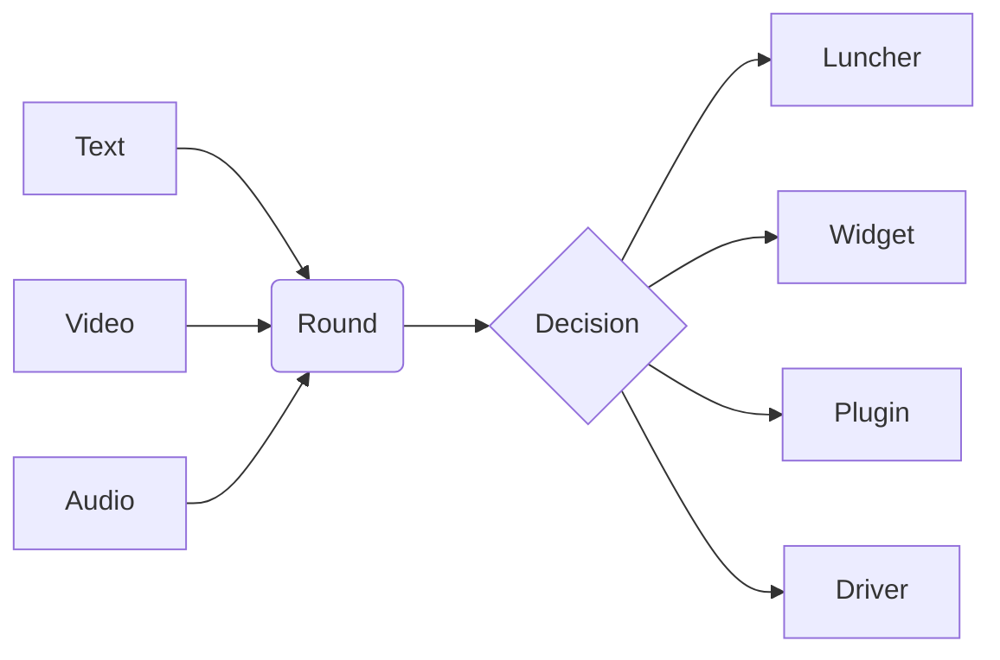

# NExT
Digital personal assistant

> [!Tip]
> Test tip

## Plugins
  - Firewall
  - Chatbot

## Drivers 
  - Map

## Lunchers
  - UI
  - Map

# Usefull Links
  - NLP
  - Documentation
    - [Simple](https://docs.github.com/en/get-started/writing-on-github/getting-started-with-writing-and-formatting-on-github/basic-writing-and-formatting-syntax)
    - [Advanced](https://docs.github.com/en/get-started/writing-on-github/working-with-advanced-formatting/organizing-information-with-tables)
