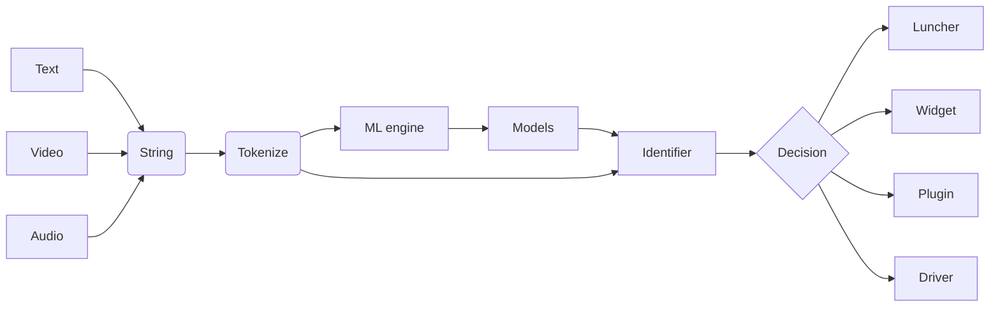

# NExT
Digital personal assistant

## Platforms
- [ ] Desktop
  - [ ] Windows
  - [x] Linux
  - [ ] Mac
- [ ] Web
- [ ] Mobile
  - [ ] Android
  - [ ] iOS

## Engines
  - Chatbot
  - Tokenizer
  - Visualizer

## Plugins
  - Firewall

## Drivers 
  - [ ] Map
  - [ ] Player
  - [ ] Contacts
  - [ ] Notes
  - [ ] Calculator
  - [ ] Calendar

# Usefull Links
  - NLP
  - Documentation
    - [Simple](https://docs.github.com/en/get-started/writing-on-github/getting-started-with-writing-and-formatting-on-github/basic-writing-and-formatting-syntax)
    - [Advanced](https://docs.github.com/en/get-started/writing-on-github/working-with-advanced-formatting/organizing-information-with-tables)
    - [Mermaid](https://github.com/mermaid-js/mermaid)
